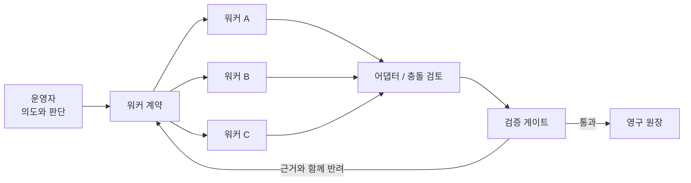

# AI 오케스트레이션 플레이북

[English](README.md) | [한국어](README.ko.md)

경계가 모호한 지식 작업을 범위와 완료 조건이 분명한 워커 작업으로 바꿉니다.
판단은 운영자가 맡고, 병렬 워커는 근거 수집·변환·검증 가능한 실행을 담당합니다.
파일 소유권, 체크포인트, 검증 게이트로 잘못된 결과를 발견하고 복구합니다.

## 작동 방식

이 저장소는 문서 정리·조사·기록 파이프라인에 적용할 수 있는 도구 중립적 운영 패턴입니다. 특정 모델이나 비공개 코드가 아니라 계약과 증거에 초점을 둡니다.

## 빠른 시작

1. [`templates/worker-contract.md`](templates/worker-contract.md)를 복사하고 목표 하나, 소유 경로, 금지선, 측정 가능한 완료 조건을 적습니다.
2. 파일 또는 자원 소유권을 기준으로 독립 작업을 나눕니다. 입력이 준비된 작업만 실행합니다.
3. 인터페이스가 맞지 않으면 워커끼리 서로의 결과를 고치게 하지 말고 어댑터 작업으로 조정합니다.
4. 모든 결과를 [`templates/verification-gate.md`](templates/verification-gate.md)로 확인합니다. 완료 메시지는 증거가 아닙니다.
5. 채택한 사실, 기각한 근거, 미해결 질문을 영구 원장에 남깁니다.

처음에는 워커 두 개와 검증자 한 개로 시작하십시오. 소유권과 복구 방식이 안정된 뒤 병렬도를 높이는 편이 안전합니다.

## 일반화한 사례

비공개 하루 운영 스냅샷을 이 저장소에 맞게 일반화했습니다. 정확한 시각, 세션 수, 토큰 합계, 저장소 식별자, 조직별 정보는 내부 처리 규모·비용·활동 패턴을 드러낼 수 있어 의도적으로 생략했습니다. 공개 사례에는 원본 비공개 기록 대신 측정 방법과 실패에서 얻은 교훈만 남겼습니다.

중요한 결과는 호출량 자체가 아니었습니다. 표시 인코딩 오류, 워커 정체, 그럴듯하지만 잘못된 저장소라는 세 실패를 발견했고, 바이트 단위 검사, 체크포인트 인계, 출처 신원 대조, 독립 검증으로 복구했습니다.

## 다음 문서

- [플레이북](docs/playbook.md): 역할, 계약, 병렬 운용, 어댑터
- [사례 연구](docs/case-study.md): 일반화한 측정, 실패, 복구
- [비용과 토큰 집계](docs/cost.md): 재현 가능한 집계와 모델 라우팅
- [개인정보와 보존](docs/privacy.md): 분류, 마스킹, 격리, 삭제
- [영문 README](README.md)

## 라이선스

[MIT](LICENSE)
