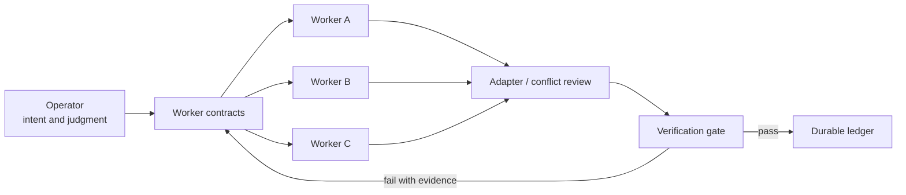

# AI Orchestration Playbook

[English](README.md) | [한국어](README.ko.md)

Turn open-ended knowledge work into bounded, verifiable worker jobs.
Keep judgment with the operator while parallel workers collect, transform, and test evidence.
Recover from bad outputs through explicit ownership, checkpoints, and verification gates.

## How it works

This repository is a tool-agnostic operating pattern for document organization, research, and record-processing pipelines. It focuses on contracts and evidence, not on a particular model or private codebase.

## Quick start

1. Copy [`templates/worker-contract.md`](templates/worker-contract.md) and define one outcome, owned paths, boundaries, and a measurable done condition.
2. Split independent jobs by file or resource ownership. Run only jobs whose inputs are ready.
3. Route interface mismatches to an adapter job instead of letting workers rewrite one another's outputs.
4. Check every result with [`templates/verification-gate.md`](templates/verification-gate.md). A completion message is not evidence.
5. Record accepted facts, rejected evidence, and unresolved questions in a durable ledger.

Start with two workers and one verifier. Add concurrency only after ownership and recovery behavior are clear.

## Generalized case

A private one-day operating snapshot was generalized for this repository. Exact timestamps, session counts, token totals, repository identifiers, and organization-specific details are intentionally omitted because they can reveal internal capacity, cost, and activity patterns. The public case preserves the measurement method and failure lessons without publishing the underlying private records.

The useful result was not raw volume. The pipeline exposed three failure modes—display encoding errors, stalled workers, and a plausible but incorrect repository—and recovered through byte-level checks, checkpoint handoff, source identity checks, and independent verification.

## Read next

- [Playbook](docs/playbook.md): roles, contracts, parallel operation, and adapters
- [Case study](docs/case-study.md): generalized measurements, failures, and recovery
- [Cost and token accounting](docs/cost.md): reproducible aggregation and routing ideas
- [Privacy and retention](docs/privacy.md): classification, redaction, quarantine, and deletion
- [Korean README](README.ko.md)

## License

[MIT](LICENSE)
